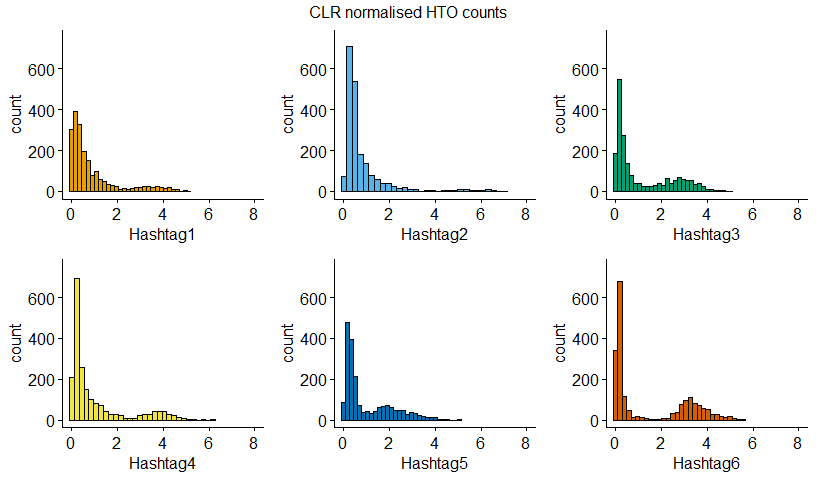
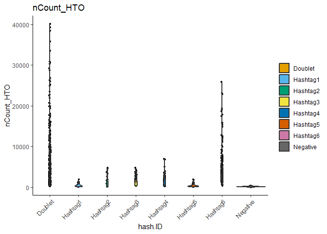
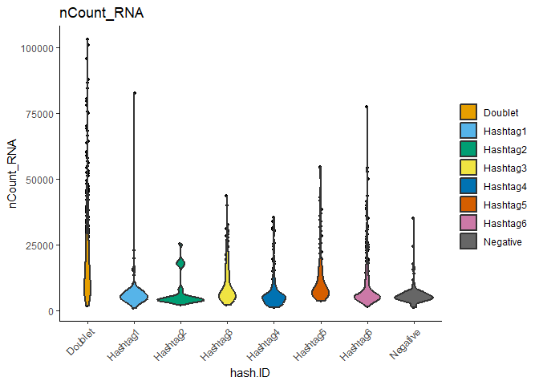
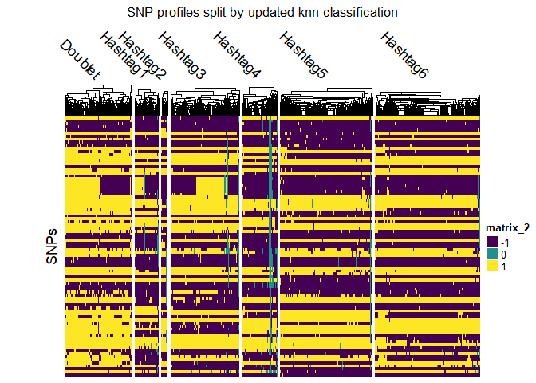
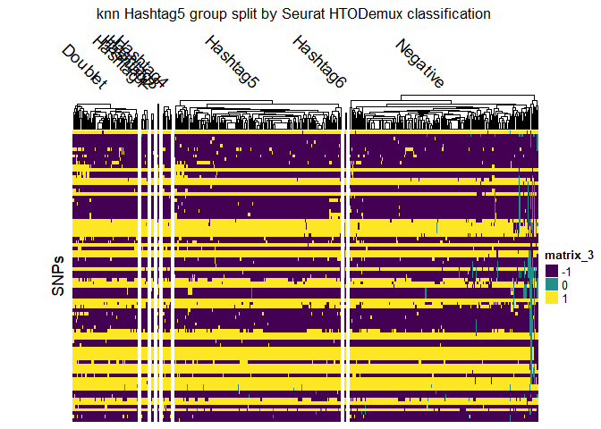
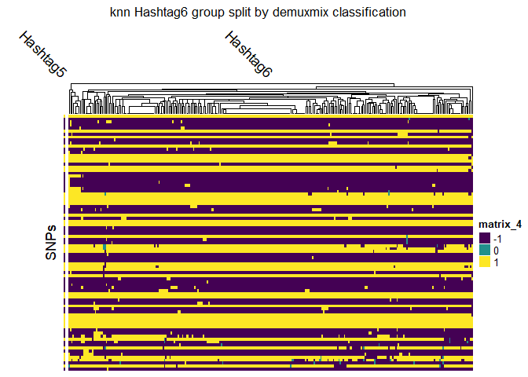

<!-- README.md is generated from README.Rmd. Please edit that file -->

# demuxSNP 

<!-- badges: start -->
<!-- badges: end -->
 
# Introduction

Multiplexing in scRNAseq involves the sequencing of samples from
different patients, treatment types or physiological locations together,
resulting in significant cost savings. The cells must then be
demultiplexed, or assigned back to their respective groups. A number of
experimental and computational methods have been proposed to facilitate
this, but a universally robust algorithm remains elusive. Below, we
introduce some existing methods, highlight the novel features of our
approach and its advantages to the user.

## Existing Methods

### Cell Hashing

Cells from each group are labelled with a distinct tag (HTO or LMO)
which is sequenced to give a counts matrix. Due to non-specific binding,
these counts form a bimodal distribution. Such methods are generally
computationally efficient. Their classification performance, however, is
highly dependent on the tagging quality and many methods do not account
for uncertainty in classification (Boggy et al. (2022), Kim et al.
(2020) & Stoeckius et al. (2018)).

More recent methods, including
[demuxmix](https://bioconductor.org/packages/release/bioc/html/demuxmix.html),
assign a probability that a cell is from a particular group, or made up
of multiple groups (doublet). This allows users to define a cut-off
threshold for the assignment confidence. Accounting for uncertainty is
an important feature for these types of algorithms. But, while they give
the user greater flexibility in determining which cells to keep, this
ultimately results in a trade-off between keeping cells which cannot be
confidently called or discarding them - due to issues with tagging
quality rather than RNA quality.

### SNPs

The second class of methods exploits natural genetic variation between
cells and so can only be used where the groups are genetically distinct.
Demuxlet (Kang et al. (2018)) uses genotype information from each group
to classify samples. This genotyping incurs additional experimental
cost. To address this, Souporcell (Heaton et al. (2020)) and Vireo
(Huang, McCarthy, and Stegle (2019)) among other methods were developed
to classify cells based on their SNPs in an unsupervised manner. Without
prior knowledge of the SNPs associated with each group, these
unsupervised methods may confuse groups with lower cell counts for other
signals in the data.

Demuxlet remains the standard often used to benchmark other methods but
its more widespread adoption has been limited by the requirement of
sample genotype information.

## demuxSNP Motivation

**With cell hashing, we can confidently demultiplex *some* but not *all*
cells. Using these high confidence cells, we can learn the SNPs
associated with each group. This SNP information can then be used to
assign remaining cells (which we could not confidently call using cell
hashing) to their most similar group based on their SNP profile.**

Novel features:

- Uses both cell hashing and SNP data. Current methods are limited to
  using one or the other.

- Selects SNPs based on being located in a gene expressed in a large
  proportion of cells to reduce noise, computational cost and increase
  interpretability.

Impact:

- Users can visually confirm validity (or lack thereof) of existing
  demultiplexing results in a tangible manner.
- Users can recover otherwise high quality cells which could not be
  confidently assigned using other methods.
- Cells from groups which are present in lower proportions may be
  classified better than with unsupervised SNP approaches.

Note: the approach used here differs from most SNP methods in that it is
supervised. We attain knowledge of which SNPs are associated with which
patients from the high confidence cells then use this to train a
classifier. It is similar to demuxlet in the sense that the classifier
uses group specific SNP information, **however** our method does not
require the expense of genotyping and so may be much more widely
applicable.

## Installation

You can install the development version of demuxSNP from
[GitHub](https://github.com/) with:

``` r
# install.packages("devtools")
devtools::install_github("michaelplynch/demuxSNP")
```

## Workflow

``` r
library(demuxSNP)
#> Warning: replacing previous import 'utils::findMatches' by
#> 'S4Vectors::findMatches' when loading 'AnnotationDbi'
library(ComplexHeatmap)
library(viridisLite)
library(Seurat)
library(ggpubr)
library(dittoSeq)
library(utils)
library(EnsDb.Hsapiens.v86)
```

``` r
colors <- structure(viridis(n = 3), names = c("-1", "0", "1"))
```

``` r
#Data loading
data(multiplexed_scrnaseq_sce, 
     commonvariants_1kgenomes_subset, 
     vartrix_consensus_snps, 
     package = "demuxSNP")

small_sce<-multiplexed_scrnaseq_sce[,1:100]
ensdb <- EnsDb.Hsapiens.v86::EnsDb.Hsapiens.v86

#Preprocessing
top_genes<-common_genes(small_sce)
vcf_sub<-subset_vcf(commonvariants_1kgenomes_subset, top_genes, ensdb)
small_sce<-high_conf_calls(small_sce)

#Use subsetted vcf with VarTrix in default 'consensus' mode to generate SNPs 
#matrix

small_sce<-add_snps(small_sce,vartrix_consensus_snps[,1:100])

small_sce<-reassign(small_sce,k=5)

table(small_sce$knn)
#> 
#>  Doublet Hashtag1 Hashtag3 Hashtag4 Hashtag5 Hashtag6 
#>       22       10       16        7       13       32
```

## Example

# Exploratory Analysis

We load three data objects: a SingleCellExperiment object containing RNA
and HTO counts, a .vcf file of class CollapsedVCF containing SNPs from
1000 Genomes common variants and a matrix containing SNP information for
each cell (we will show you how to generate this SNPs matrix using
[VarTrix](https://github.com/10XGenomics/vartrix) outside of R). We have
already removed low quality cells (library size\<1,000 and percentage of
genes mapping to mitochondrial genes\>10%).

``` r

class(multiplexed_scrnaseq_sce)
#> [1] "SingleCellExperiment"
#> attr(,"package")
#> [1] "SingleCellExperiment"
class(commonvariants_1kgenomes_subset)
#> [1] "CollapsedVCF"
#> attr(,"package")
#> [1] "VariantAnnotation"
class(vartrix_consensus_snps)
#> [1] "matrix" "array"
```

The HTO or LMO distribution is usually bimodal, with a signal (high
counts) and background distribution (low counts) caused by non-specific
binding. Ideally, these distributions would be clearly separated with no
overlap, but in practice, this is not always the case. In our example
data, we see that the signal and noise overlap to varying extents in
each group.



We will begin by running Seurat’s HTODemux, a popular HTO demultiplexing
algorithm on the data.

``` r
logcounts(multiplexed_scrnaseq_sce) <- counts(multiplexed_scrnaseq_sce)
seurat <- as.Seurat(multiplexed_scrnaseq_sce)
seurat <- HTODemux(seurat)
#> Cutoff for Hashtag1 : 44 reads
#> Cutoff for Hashtag2 : 39 reads
#> Cutoff for Hashtag3 : 323 reads
#> Cutoff for Hashtag4 : 99 reads
#> Cutoff for Hashtag5 : 107 reads
#> Cutoff for Hashtag6 : 175 reads
seurat$hash.ID <- factor(as.character(seurat$hash.ID))
multiplexed_scrnaseq_sce$seurat <- seurat$hash.ID

multiplexed_scrnaseq_sce$seurat <- seurat$hash.ID

table(multiplexed_scrnaseq_sce$seurat)
#> 
#>  Doublet Hashtag1 Hashtag2 Hashtag3 Hashtag4 Hashtag5 Hashtag6 Negative 
#>      633      121       29      264      158      177      383      235
```

Although HTO library size of the Negative group is low, the RNA library
size is similar to that of other groups, indicating that they may be
misclassified as Negative due to their tagging quality rather than
overall RNA quality.

``` r
dittoPlot(seurat, "nCount_HTO", group.by = "hash.ID")
```



``` r
dittoPlot(seurat, "nCount_RNA", group.by = "hash.ID")
```



For the remainder of this vignette we will outline our method of
checking whether or not these cells have been called correctly and how
to assign them to their appropriate group!

# Preprocessing

Common variants files, for example from the 1000 Genomes Project, can
contain over 7 million SNPs. To reduce computational cost and cell-type
effects, we subset our SNPs list to those located within genes expressed
across most cells in our data.

We first find the most commonly expressed genes in our RNA data.

``` r
top_genes <- common_genes(sce = multiplexed_scrnaseq_sce, n = 100)

top_genes[1:10]
#>  [1] "TPT1"   "RPL13"  "RPL28"  "TMSB4X" "RPS27"  "EEF1A1" "RPL41"  "B2M"   
#>  [9] "RPLP1"  "RPL32"
```

We have a sample .vcf preloaded, but you can load your .vcf file in
using ‘readVcf()’ from
[VariantAnnotation](https://bioconductor.org/packages/release/bioc/html/VariantAnnotation.html).

We will subset our .vcf file to SNPs seen in commonly expressed genes
from our dataset. Notice that the genome for the vcf and EnsDb object
must be compatible!

The returned vcf can be written to file and used with VarTrix later on.

``` r
ensdb <- EnsDb.Hsapiens.v86::EnsDb.Hsapiens.v86

genome(commonvariants_1kgenomes_subset)[1] == genome(ensdb)[1]
#>    1 
#> TRUE

new_vcf <- subset_vcf(commonvariants_1kgenomes_subset, top_genes = top_genes, ensdb)
commonvariants_1kgenomes_subset
#> class: CollapsedVCF 
#> dim: 2609 0 
#> rowRanges(vcf):
#>   GRanges with 5 metadata columns: paramRangeID, REF, ALT, QUAL, FILTER
#> info(vcf):
#>   DataFrame with 1 column: AF
#> info(header(vcf)):
#>       Number Type  Description                                  
#>    AF A      Float Estimated allele frequency in the range (0,1)
#> geno(vcf):
#>   List of length 0:
new_vcf
#> class: CollapsedVCF 
#> dim: 2399 0 
#> rowRanges(vcf):
#>   GRanges with 5 metadata columns: paramRangeID, REF, ALT, QUAL, FILTER
#> info(vcf):
#>   DataFrame with 1 column: AF
#> info(header(vcf)):
#>       Number Type  Description                                  
#>    AF A      Float Estimated allele frequency in the range (0,1)
#> geno(vcf):
#>   List of length 0:
```

The subsetted .vcf can be written to disk using ‘writeVcf()’, again from
[VariantAnnotation](https://bioconductor.org/packages/release/bioc/html/VariantAnnotation.html)
package.

Next, we wish to identify cells which we can confidently call to a
particular group. There are a number of ways this can be achieved,
including probabilistic modelling of the HTO counts, manually setting
non-conservative thresholds or using consensus calls. The user may wish
to experiment with different approaches. Here we have used
[demuxmix](https://bioconductor.org/packages/release/bioc/html/demuxmix.html),
a probabilistic model which we have set with a high acceptance threshold
to identify high confidence cell calls to use as training data (cells
which we can confidently call as a particular singlet group).

``` r
multiplexed_scrnaseq_sce <- high_conf_calls(multiplexed_scrnaseq_sce)

table(multiplexed_scrnaseq_sce$train)
#> 
#> FALSE  TRUE 
#>   955  1045

table(multiplexed_scrnaseq_sce$predict)
#> 
#> TRUE 
#> 2000

table(multiplexed_scrnaseq_sce$labels)
#> 
#>  Hashtag1  Hashtag2  Hashtag3  Hashtag4  Hashtag5  Hashtag6 multiplet  negative 
#>        62        15       226       102       348       292       335        12 
#> uncertain 
#>       608
```

So, for this particular dataset, we can confidently call 1,045 cells as
being from a particular singlet group. 608 cells cannot be called to a
group with high confidence.

# Variant Calling (VarTrix)

Variant calling is not done within the package. Instead, we refer the
reader to [VarTrix](https://github.com/10XGenomics/vartrix), where they
can use the subsetted .vcf file along with their .bam, barcodes.tsv and
reference genome to call SNPs in each cell.

A sample VarTrix command looks like the following:

``` bash

./vartrix -v <path_to_input_vcf> -b <path_to_cellranger_bam> -f <path_to_fasta_file> -c <path_to_cell_barcodes_file> -o <path_for_output_matrix>
```

Using the output matrix from Vartrix and the high confidence
classifications from the HTO algorithm, we can reassign cells using
k-nearest neighbours.

# Cell Reassignment, Visualisation and Evaluation

To keep things tidy, we will add the SNP data to our
SingleCellExperiment object as an altExp. We recode the SNP matrix as
follows: 0=no read, 1=SNP present, -1=SNP absent. This function also
filters out SNPs which are observed at a low frequency in the data, and
the frequency threshold can be set manually.

``` r
dim(vartrix_consensus_snps)
#> [1] 2542 2000

multiplexed_scrnaseq_sce <- add_snps(multiplexed_scrnaseq_sce, vartrix_consensus_snps, thresh = 0.95)

altExp(multiplexed_scrnaseq_sce, "SNP")
#> class: SingleCellExperiment 
#> dim: 85 2000 
#> metadata(0):
#> assays(1): counts
#> rownames(85): Snp Snp ... Snp Snp
#> rowData names(0):
#> colnames(2000): AAACCTGAGATCTGCT-1 AAACCTGAGCGTCAAG-1 ...
#>   ACTTTCAGTAAGTTCC-1 ACTTTCAGTAGGCATG-1
#> colData names(0):
#> reducedDimNames(0):
#> mainExpName: NULL
#> altExpNames(0):
```

Before we reassign any cells, we will first use the SNPs data to inspect
the results from stand-alone algorithms. Splitting the SNP data by
Seurat HTODemux classification, we initially see a large number of
‘negative’ cells which appear of good quality (high proportion of reads)
which may be assignable to another group. This is consistent with the
library size plot we visualised earlier.

``` r
hm <- Heatmap(counts(altExp(multiplexed_scrnaseq_sce, "SNP")),
    column_split = multiplexed_scrnaseq_sce$seurat,
    cluster_rows = FALSE,
    show_column_names = FALSE,
    cluster_column_slices = FALSE,
    column_title_rot = -45,
    row_title = "SNPs",
    show_row_names = FALSE,
    col = colors
)

draw(hm,
    column_title = "SNP profiles split by Seurat HTODemux call",
    padding = unit(c(2, 15, 2, 2), "mm")
)
```


We will use our knn method to reassign cells based on their SNP
profiles. The training data is the high confidence cells

``` r
set.seed(1)
multiplexed_scrnaseq_sce <- reassign(multiplexed_scrnaseq_sce,
    k = 10,
    d = 10,
    train_cells = multiplexed_scrnaseq_sce$train,
    predict_cells = multiplexed_scrnaseq_sce$predict
)

table(multiplexed_scrnaseq_sce$knn)
#> 
#>  Doublet Hashtag1 Hashtag2 Hashtag3 Hashtag4 Hashtag5 Hashtag6 
#>      337      119       30      349      174      464      527
```

``` r
hm <- Heatmap(counts(altExp(multiplexed_scrnaseq_sce, "SNP")),
    column_split = multiplexed_scrnaseq_sce$knn,
    cluster_rows = FALSE,
    show_column_names = FALSE,
    cluster_column_slices = FALSE,
    column_names_rot = 45,
    column_title_rot = -45,
    row_title = "SNPs",
    show_row_names = FALSE,
    col = colors
)

draw(hm,
    column_title = "SNP profiles split by updated knn classification",
    padding = unit(c(2, 15, 2, 2), "mm")
)
```



Focusing in on the knn Hashtag5 group, we see that a lot of the Negative
cells have now been correctly reclassed to this group, as well as a
small number of cells from other groups.

``` r
hm <- Heatmap(counts(altExp(multiplexed_scrnaseq_sce, "SNP"))[, multiplexed_scrnaseq_sce$knn == "Hashtag5"],
    column_split = multiplexed_scrnaseq_sce$seurat[multiplexed_scrnaseq_sce$knn == "Hashtag5"],
    cluster_rows = FALSE,
    show_column_names = FALSE,
    cluster_column_slices = FALSE,
    column_names_rot = 45,
    column_title_rot = -45,
    row_title = "SNPs",
    show_row_names = FALSE,
    col = colors
)

draw(hm,
    column_title = "knn Hashtag5 group split by Seurat HTODemux classification",
    padding = unit(c(2, 15, 2, 2), "mm")
)
```



## Performance

Next we will run some basic performance checks. We subset our
SingleCellExperiment object to only retain cells which we could
confidently call as being from a singlet group, then split this into a
training and test dataset.

``` r
sce_test <- multiplexed_scrnaseq_sce[, multiplexed_scrnaseq_sce$train == TRUE]
sce_test$knn <- NULL
sce_test$labels <- droplevels(sce_test$labels)
sce_test
#> class: SingleCellExperiment 
#> dim: 259 1045 
#> metadata(0):
#> assays(2): counts logcounts
#> rownames(259): RPL22 CDC42 ... MT-ND5 MT-CYB
#> rowData names(0):
#> colnames(1045): AAACCTGAGCGTCAAG-1 AAACCTGAGGCGTACA-1 ...
#>   ACTTTCAGTAAGAGAG-1 ACTTTCAGTAAGTTCC-1
#> colData names(11): orig.ident nCount_RNA ... predict labels
#> reducedDimNames(0):
#> mainExpName: RNA
#> altExpNames(2): HTO SNP

sce_test$train2 <- rep(FALSE, length(sce_test$train))
sce_test$train2[seq_len(500)] <- TRUE

sce_test$test <- sce_test$train2 == FALSE
```

Comparing the predicted labels in the test dataset with the hidden high
confidence labels, we see excellent agreement.

``` r
sce_test <- reassign(sce_test, k = 3, train_cells = sce_test$train2, predict_cells = sce_test$test)

table(sce_test$labels[sce_test$test == TRUE], sce_test$knn[sce_test$test == TRUE])
#>           
#>            Doublet Hashtag1 Hashtag2 Hashtag3 Hashtag4 Hashtag5 Hashtag6
#>   Hashtag1       1       35        0        0        0        0        0
#>   Hashtag2       1        0       10        0        0        0        0
#>   Hashtag3       0        0        0      122        0        0        0
#>   Hashtag4       0        0        0        0       46        0        0
#>   Hashtag5       1        0        0        0        0      193        1
#>   Hashtag6       0        0        0        0        0        0      135
```

We can also show that that the model can correct misclassified cells
when predicted back on the training data. We create a new vector
“labels2” which is initially identical to the labels used in training
previously.

``` r
sce_test$knn <- NULL

sce_test$labels2 <- droplevels(sce_test$labels)

table(sce_test$labels, sce_test$labels2)
#>           
#>            Hashtag1 Hashtag2 Hashtag3 Hashtag4 Hashtag5 Hashtag6
#>   Hashtag1       62        0        0        0        0        0
#>   Hashtag2        0       15        0        0        0        0
#>   Hashtag3        0        0      226        0        0        0
#>   Hashtag4        0        0        0      102        0        0
#>   Hashtag5        0        0        0        0      348        0
#>   Hashtag6        0        0        0        0        0      292
```

We then randomly reassign 25 cells from Hashtag5 to Hashtag2 in the
training data. Predicting the model back on itself we see that in the
new predicted labels, the 25 altered have been correctly reclassified
back to Hashtag5

``` r
sce_test$labels2[which(sce_test$labels2 == "Hashtag5")[1:25]] <- "Hashtag2"

table(sce_test$labels, sce_test$labels2)
#>           
#>            Hashtag1 Hashtag2 Hashtag3 Hashtag4 Hashtag5 Hashtag6
#>   Hashtag1       62        0        0        0        0        0
#>   Hashtag2        0       15        0        0        0        0
#>   Hashtag3        0        0      226        0        0        0
#>   Hashtag4        0        0        0      102        0        0
#>   Hashtag5        0       25        0        0      323        0
#>   Hashtag6        0        0        0        0        0      292

sce_test <- reassign(sce_test,
    train_cells = sce_test$train,
    predict_cells = sce_test$train
)

table(sce_test$labels, sce_test$knn)
#>           
#>            Doublet Hashtag1 Hashtag2 Hashtag3 Hashtag4 Hashtag5 Hashtag6
#>   Hashtag1       0       62        0        0        0        0        0
#>   Hashtag2       0        0       15        0        0        0        0
#>   Hashtag3       0        0        0      226        0        0        0
#>   Hashtag4       0        0        0        0      102        0        0
#>   Hashtag5       1        0        0        0        0      346        1
#>   Hashtag6       0        0        0        0        0        0      292
```

For the knn Hashtag6 group, we see mostly good agreement with the
original demuxmix labels. However, it appears one cell now being called
a Hashtag6 was originally called Hashtag5. Again, we can investigate
this by visualising the corresponding SNP profile. In doing so, we can
see that this most likely is a true Hashtag6.

``` r
hm <- Heatmap(counts(altExp(sce_test, "SNP"))[, sce_test$knn == "Hashtag6"],
    column_split = sce_test$labels[sce_test$knn == "Hashtag6"],
    cluster_rows = FALSE,
    show_column_names = FALSE,
    cluster_column_slices = FALSE,
    column_names_rot = 45,
    column_title_rot = -45,
    row_title = "SNPs",
    show_row_names = FALSE,
    col = colors
)

draw(hm,
    column_title = "knn Hashtag6 group split by demuxmix classification",
    padding = unit(c(2, 15, 2, 2), "mm")
)
```



# References

<div id="refs" class="references csl-bib-body hanging-indent">

<div id="ref-boggy_bff_2022" class="csl-entry">

Boggy, Gregory J, G W McElfresh, Eisa Mahyari, Abigail B Ventura, Scott
G Hansen, Louis J Picker, and Benjamin N Bimber. 2022. “BFF and <span
class="nocase">cellhashR</span>: Analysis Tools for Accurate
Demultiplexing of Cell Hashing Data.” *Bioinformatics* 38 (10):
2791–801. <https://doi.org/10.1093/bioinformatics/btac213>.

</div>

<div id="ref-heaton_souporcell_2020" class="csl-entry">

Heaton, Haynes, Arthur M. Talman, Andrew Knights, Maria Imaz, Daniel J.
Gaffney, Richard Durbin, Martin Hemberg, and Mara K. N. Lawniczak. 2020.
“Souporcell: Robust Clustering of Single-Cell RNA-Seq Data by Genotype
Without Reference Genotypes.” *Nature Methods* 17 (6): 615–20.
<https://doi.org/10.1038/s41592-020-0820-1>.

</div>

<div id="ref-huang_vireo_2019" class="csl-entry">

Huang, Yuanhua, Davis J. McCarthy, and Oliver Stegle. 2019. “Vireo:
Bayesian Demultiplexing of Pooled Single-Cell RNA-Seq Data Without
Genotype Reference.” *Genome Biology* 20 (1): 273.
<https://doi.org/10.1186/s13059-019-1865-2>.

</div>

<div id="ref-kang_multiplexed_2018" class="csl-entry">

Kang, Hyun Min, Meena Subramaniam, Sasha Targ, Michelle Nguyen, Lenka
Maliskova, Elizabeth McCarthy, Eunice Wan, et al. 2018. “Multiplexed
Droplet Single-Cell RNA-Sequencing Using Natural Genetic Variation.”
*Nature Biotechnology* 36 (1): 89–94.
<https://doi.org/10.1038/nbt.4042>.

</div>

<div id="ref-kim_citefuse_2020" class="csl-entry">

Kim, Hani Jieun, Yingxin Lin, Thomas A Geddes, Jean Yee Hwa Yang, and
Pengyi Yang. 2020. “CiteFuse Enables Multi-Modal Analysis of CITE-Seq
Data.” *Bioinformatics* 36 (14): 4137–43.
<https://doi.org/10.1093/bioinformatics/btaa282>.

</div>

<div id="ref-stoeckius_cell_2018" class="csl-entry">

Stoeckius, Marlon, Shiwei Zheng, Brian Houck-Loomis, Stephanie Hao,
Bertrand Z. Yeung, William M. Mauck, Peter Smibert, and Rahul Satija.
2018. “Cell Hashing with Barcoded Antibodies Enables Multiplexing and
Doublet Detection for Single Cell Genomics.” *Genome Biology* 19 (1):
224. <https://doi.org/10.1186/s13059-018-1603-1>.

</div>

</div>
